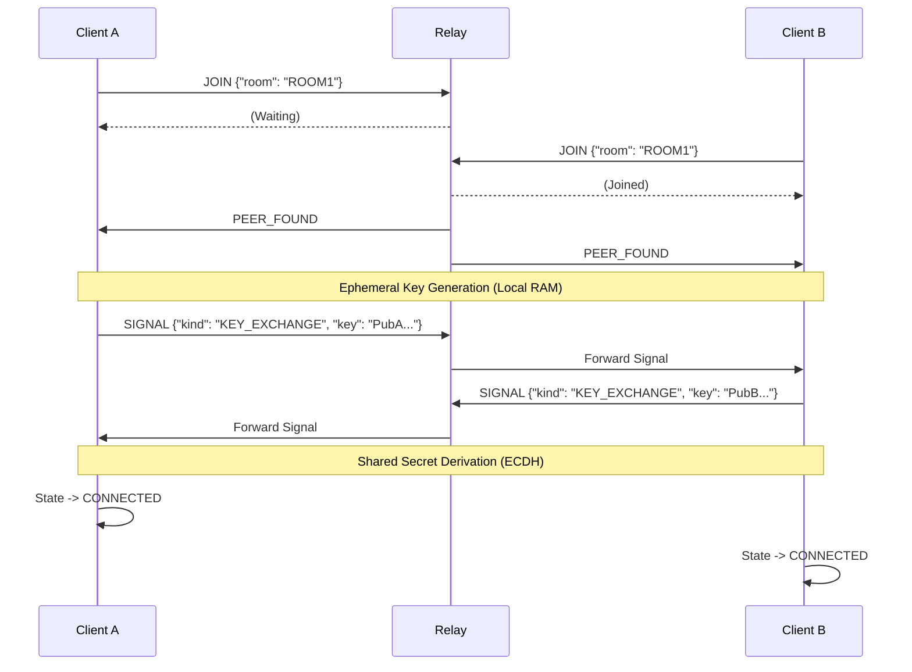

# System Architecture Documentation

**Project:** Secure CLI Peer-to-Peer Chat Application  
**Version:** 1.0.0  
**Status:** Active Prototype

---

## 1. Executive Summary

The Secure CLI Chat Application is a terminal-based communication tool designed for high-security, ephemeral, and anonymous text exchange. Unlike traditional messaging platforms that store history or rely on central identity servers, this system employs a **Zero Trust** architecture where:
- All encryption keys are generated in volatile memory (RAM) and never written to disk.
- The relay server acts as a blind tunnel, unable to inspect or persist traffic.
- Sessions are strictly peer-to-peer (P2P) logic routed through a lightweight WebSocket relay.

This document serves as the authoritative technical reference for developers, security auditors, and system architects.

---

## 2. High-Level Architecture

The system follows a **Client-Server-Client** topology where the server (Relay) is minimized to a packet-forwarding role. The intelligence, security, and state management reside entirely on the Client edges.

### 2.1 Context Diagram

```mermaid
graph TD
    UserA[User A (Terminal)] -->|Input/Output| ClientA[Secure Chat Client A]
    UserB[User B (Terminal)] -->|Input/Output| ClientB[Secure Chat Client B]
    
    subgraph "Untrusted Network"
        ClientA <-->|Encrypted WebSocket (TLS)| Relay[Relay Server]
        Relay <-->|Encrypted WebSocket (TLS)| ClientB
    end

    style ClientA fill:#cfc,stroke:#333,stroke-width:2px
    style ClientB fill:#cfc,stroke:#333,stroke-width:2px
    style Relay fill:#f9f,stroke:#333,stroke-width:2px,stroke-dasharray: 5 5
```

### 2.2 Core Design Principles

1.  **Ephemeral By Design:** No database, no logs, no config files with secrets. Everything resets on process exit.
2.  **End-to-End Encryption (E2EE):** Data is encrypted *before* it touches the network stack.
3.  **Strict State Management:** The application can only exist in one valid state at a time (e.g., you cannot send a message if you are still in `KEY_SETUP`).
4.  **Modular Isolation:** Cryptography code is separated from UI and Network code to minimize side-channel risks.

---

## 3. Technology Stack

### 3.1 Language & Runtime
*   **Language:** Python 3.10+ (Type Hints enabled)
*   **Runtime:** Standard CPython (with potential for PyPy for performance).

### 3.2 Libraries & Dependencies
| Library | Purpose | Justification |
| :--- | :--- | :--- |
| **`PyNaCl`** | Cryptography | Python binding for `libsodium`. Provides "best-practice" primitives (Curve25519, XSalsa20, Poly1305) avoiding low-level crypto pitfalls. |
| **`websockets`** | Networking | Asyncio-based WebSocket implementation. Robust, standards-compliant, and handles long-lived connections efficiently. |
| **`rich`** | UI | Renders advanced terminal graphics (panels, colors, progress bars) for a professional UX. |
| **`prompt_toolkit`** | Input | Handles asynchronous user input, preventing the blocking of network threads while typing. |

---

## 4. Component Design

The application structure is domain-driven.

### 4.1 Core Module (`core/`)
*   **`SessionManager`**: The "Brain" of the client. It owns the `KeyManager`, `EncryptionHandler`, and `TransportLayer`. It mediates data flow between these components using the Observer pattern (callbacks).
*   **`StateMachine` (`state_machine.py`)**: Enforces the valid lifecycle of a chat session.
    *   *States:* `INIT` -> `SEARCHING` -> `USER_FOUND` -> `KEY_SETUP` -> `CONNECTED` -> `DISCONNECTED` -> `DESTROYED`.

### 4.2 Cryptography Module (`crypto/`)
*   **`KeyManager`**: Handles `private_key` (Curve25519) generation.
    *   *Security:* Keys are stored as instance attributes. The `wipe_keys()` method attempts to clear these references.
*   **`EncryptionHandler`**: Wraps `nacl.public.Box`.
    *   *Algorithm:* **X25519** for key exchange, **XSalsa20** for stream encryption, **Poly1305** for MAC (Message Authentication Code).
*   **`MemoryWiper`**: A utility class attempting `ctypes` based memory overwrites for mutable buffers (best effort in managed Python).

### 4.3 Network Module (`network/`)
*   **`TransportLayer`**: Manages the raw WebSocket connection.
    *   *Protocol:* JSON-based signaling.
    *   *Responsibility:* Reconnecting, sending raw strings, parsing incoming JSON, handling socket errors.
*   **`Relay Guard`** (Concept): Logic within the relay to ensure max 2 peers per room.

### 4.4 User Interface (`ui/`)
*   **`SecureChatCLI`**: The view layer.
    *   Uses `rich.console` for output.
    *   Uses `prompt_toolkit.PromptSession` for non-blocking input.
    *   *Isolation:* The UI knows nothing about crypto keys; it only receives plaintext strings from `SessionManager`.

---

## 5. Data Flow & Protocols

### 5.1 Connection & Handshake Sequence



### 5.2 Relay Protocol Specification
The Relay Server expects JSON payloads.

**1. Join Room**
```json
{
  "type": "JOIN",
  "room": "TargetRoomCode"
}
```

**2. Signal (Generic Forwarding)**
Used for Key Exchange and Encrypted Messages.
```json
{
  "type": "SIGNAL",
  "kind": "KEY_EXCHANGE" | "MSG",
  "payload": "<Base64 Encoded Content>",
  "key": "<Optional Public Key>"
}
```

---

## 6. Security Considerations

### 6.1 Threat Model
| Threat | Mitigation | Status |
| :--- | :--- | :--- |
| **Relay Compromise** | The relay only sees encrypted blobs (XSalsa20). It cannot decrypt traffic without the private keys which never leave the clients. | ✅ Secure |
| **Man-in-the-Middle (MITM)** | The initial key exchange is susceptible to MITM if the Relay is active and malicious during the handshake (Active Attack). | ⚠️ Risk (See Future Plans) |
| **Endpoint Seizure** | If a user's machine is seized *during* a chat, keys are in RAM. | ⚠️ Risk (RAM Extraction) |
| **Forensics** | Once the app closes, `wipe_keys()` runs. Python GC makes perfect erasure hard, but no file persistence makes recovery extremely difficult. | ✅ Resilient |

### 6.2 Application Security
*   **Rate Limiting:** The `RateLimiter` class (Token Bucket algorithm) prevents a user from flooding the connection, which could crash the peer's decryption routine or UI.
*   **Input Validation:** Strict regex on Room Codes (`^[A-Z0-9]+$`) prevents injection attacks in the relay logic.

---

## 7. Scalability & Deployment

### 7.1 Scalability
*   **Current Limit:** The Relay Server is single-process, asyncio-based. It can handle thousands of concurrent *idle* connections, but high-throughput active chats will be CPU-bound by Python's GIL.
*   **Scaling Strategy:** 
    1.  Deploy multiple Relay nodes behind a Load Balancer.
    2.  Use Redis Pub/Sub to sync "Room State" across nodes (so Client A on Node 1 can talk to Client B on Node 2).

### 7.2 Deployment
*   **Local:** Uses `run.sh` to spawn a `localhost` relay.
*   **Production:** The `relay_server.py` should be run behind Nginx/Caddy with SSL termination (`wss://`) to protect against passive network sniffing of metadata (like IP addresses).

---

## 8. Testing & Maintenance

### 8.1 Testing Strategy
*   **Unit Tests:** Test `crypto` functions with test vectors (Ensure A encrypts -> B decrypts).
*   **Integration Tests:** Spawn 2 subprocess clients and verify they reach `CONNECTED` state.
*   **Fuzzing:** Send malformed JSON to the Relay and Client Transport to ensure no crashes.

### 8.2 Maintenance Plan
*   **Dependency Audits:** Regular `pip audit` to check for vulnerabilities in `cryptography` or `websockets`.
*   **Key Rotation:** Not needed (Sessions are ephemeral).

---

## 9. Future Roadmap

### 9.1 Short Term (v1.1)
*   **Authentication:** Shared Password / Pre-Shared Key (PSK) verification *before* key exchange to prevent MITM.
*   **File Transfer:** Chunked, encrypted file transfer support.

### 9.2 Long Term (v2.0)
*   **Tor Integration:** Route traffic over Tor (Socks5) to hide IP addresses from the Relay.
*   **Rust Rewrite:** Move the Core and Crypto modules to a Rust extension module (PyO3) for true memory safety and perfect wiping.
*   **Auditable Builds:** Reproducible builds to guarantee the source matches the binary.

---
*Generated by Gemini CLI Agent*
