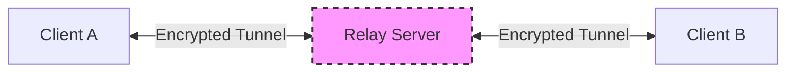

# Secure CLI Peer-to-Peer Chat Application

A secure, terminal-based chat application designed for ephemeral, end-to-end encrypted communication. This tool prioritizes security, privacy, and zero-trace data handling.

## 🚀 Overview

This application establishes a secure, temporary tunnel between two clients using a lightweight relay server. It is built on a "Zero Trust" architecture:
- **End-to-End Encryption (E2EE):** Messages are encrypted on the sender's device and only decrypted by the recipient. The relay server sees only encrypted blobs.
- **Ephemeral Sessions:** Keys are generated in RAM at runtime and destroyed immediately upon disconnection. No data is ever written to disk.
- **Strict Isolation:** The application runs in a strictly controlled environment to prevent data leakage.

## ✨ Key Features

*   **Strong Cryptography:** Uses `PyNaCl` (libsodium) for Curve25519 key exchange and ChaCha20-Poly1305 authenticated encryption.
*   **Zero Persistence:** No logs, no history, no saved keys.
*   **Network Isolation:** Strict 2-peer limit per session.
*   **Visual CLI:** Built with `rich` for a modern, dashboard-like terminal interface.
*   **One-Click Launch:** Automated setup and relay management via `run.sh`.

## 🛠️ Architecture



1.  **Transport Layer:** WebSockets (via `websockets` library).
2.  **Protocol:** Custom JSON-based signaling for handshake, followed by encrypted blob exchange.
3.  **Relay:** A "dumb" forwarder. It does not store messages or manage identity, only connects two sockets based on a shared Room Code.

## 📦 Installation & Usage

### Prerequisites
*   **OS:** macOS, Linux (Windows via WSL)
*   **Python:** 3.10 or higher
*   **Git**

### Quick Start

1.  **Clone the Repository**
    ```bash
    git clone git@github.com:mdkaif2004/Secure_CLI_Chat_App.git
    cd Secure_CLI_Chat_App
    ```

2.  **Start the Application**
    Simply run the launcher script. It handles virtual environment creation and dependency installation automatically.
    ```bash
    ./run.sh
    ```

3.  **Connect with a Peer**
    *   **User 1:** Run `./run.sh`, enter a **Room Code** (e.g., `SECRET123`).
    *   **User 2:** Run `./run.sh` in a separate terminal/machine, enter the **SAME Room Code**.
    *   The secure channel is established automatically.

### Commands
*   Type your message and press **Enter** to send.
*   Type `/quit` to end the session and wipe keys.

## 📂 Project Structure

```
.
├── run.sh                  # Entry point: Env setup & launcher
├── main.py                 # Application bootstrapper
├── relay_server.py         # Lightweight WebSocket relay
├── requirements.txt        # Python dependencies
├── core/
│   ├── session_manager.py  # Orchestrates connection & encryption
│   └── state_machine.py    # Enforces application states
├── crypto/
│   ├── key_manager.py      # Ephemeral key generation (RAM only)
│   ├── encryption.py       # NaCl Box implementation
│   └── memory_wiper.py     # Secure memory cleanup tools
├── network/
│   └── transport.py        # WebSocket client logic
├── security/
│   └── rate_limiter.py     # Anti-spam protection
├── ui/
│   └── cli.py              # Rich-based terminal UI
└── utils/
    ├── validators.py       # Input validation
    └── error_codes.py      # Standardized error definitions
```

## 🔒 Security Model

1.  **Key Exchange:** Ephemeral Curve25519 public keys are exchanged via the relay.
2.  **Session:** A shared secret is derived using ECDH.
3.  **Encryption:** All messages are encrypted with ChaCha20-Poly1305.
4.  **Forward Secrecy:** New keys are generated for every session. Recovering a past key (impossible as they are wiped) would not compromise future sessions.
5.  **Memory Hygiene:** The `MemoryWiper` utility attempts to overwrite sensitive data in memory before releasing references (best-effort in Python).

## 🤝 Contributing

Contributions are welcome! Please ensure any changes adhere to the core principles:
*   **No disk I/O** for message data.
*   **No external dependencies** that track user activity.
*   **Strict typing** and error handling.

## 📄 License

This project is open-source. Use at your own risk.